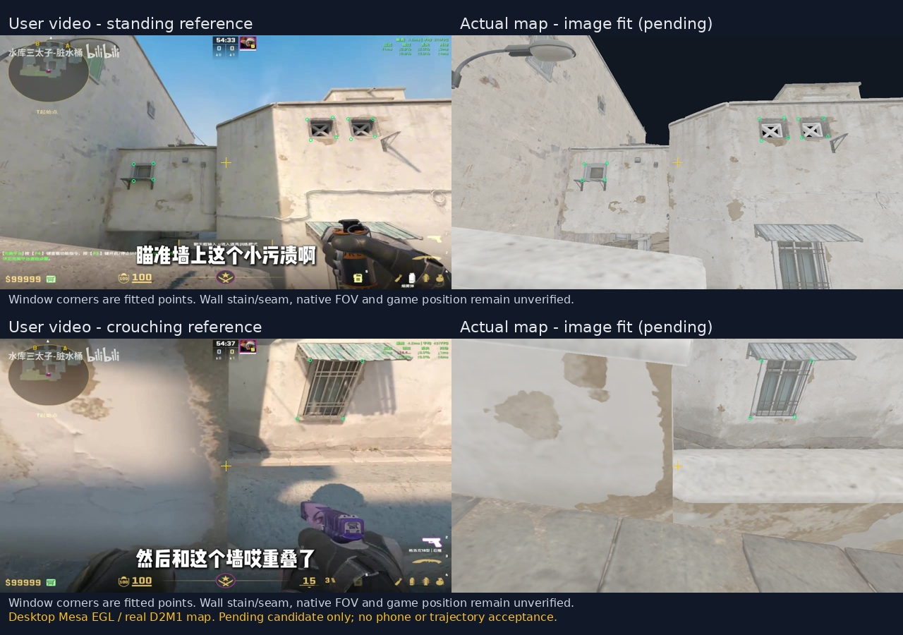

# C015 第一批：挂门烟真实地图空间候选

本批按最新 C015 先交 D2-001 挂门烟空间小包。继承用户来源 `user-selected-20261004-v2` 与资源检查点 `3d1a74fed7a96597313ed1073d5684927f7bfe19`；最新 main 为 `b329ef098bfff85f0cf593b8d0f8bd98b0973335`。保留当前地图和全层碰撞，没有改 APP Kotlin、契约、APP/PM进度或地图分卷。

入口：`D2-001-spatial-candidate.json`。它是校准证据文件，**不能直接交给 CourseJson 当可播放课程**。运行格式继续沿用 C013/C014；`candidateValues` 使用原字段名供 APP 开发采集/相机对照，已验证运行值仍 null、`importable=false`。原 C014 正式草稿保持空值，未复制旧网页或 DEV 数据。



## 已算出的第一组候选

| 项目 | 显示空间候选 XYZ / 参数 | 依据 |
| --- | --- | --- |
| 脚底 | (-8.7064, 2.1674, 17.3377) | 拟合眼位下方 layer 0 world_physics 支撑面；不是控制台实测 |
| 站姿眼位 | (-8.7064, 3.8806, 17.3377) | 视频21秒三扇窗12个手选窗框点的透视拟合 |
| 蹲姿眼位 | (-8.7064, 3.4713, 17.3377) | 同水平位置，视频18秒下窗4点拟合；姿态高度仍待游戏复现 |
| 世界瞄点 | (-9.0926, 5.6666, 10.0313) | 候选相机中心射线与实际D2M1模型相交；污点语义尚未确认 |
| APP瞄准相机 | yaw 3.0264°，pitch -13.7176°，垂直FOV候选67.8585° | 按 FreeCamera 正pitch向下、yaw=0朝-Z换算；不是Source欧拉角 |

每个坐标保留足够精度用于复现，表中小数位不表示测量精度。Source逆转换只供追溯，不是从游戏取出的控制台坐标。拟合图横向比例候选1.2799用于解释视频投影；原运行schema未增加该字段。`aim-normal-aspect`图使用正常比例，供APP在实际视口检查同一世界眼位与准星。

站姿拟合每坐标RMSE约2.92像素，蹲姿约3.22像素；这些是**用于拟合的点误差**，没有独立留出点验证。64次3像素参考点扰动显示明显退化：仅条件灵敏度的站位Z第5～95百分位为16.06～19.50、FOV为54.17～77.84度，不能把低像素误差当作精确三维校准。该范围也不是包含地图版本/手选模型点误差的完整置信区间。

## 支撑面与纹理的实际检查

模型地面命中 `p00550`、材质62；碰撞命中 triangle254344 / shape10093 / layer0，法线Y约0.969。两者高度相差约0.000182显示单位；同水平位置附近±0.1的五次查询均有支撑面。此检查证明候选局部显示面与world_physics对齐，不证明玩家碰撞体可卡位、墙缝语义正确或官方人物行走已实现。无需重做整个地图才能继续本处静态定位。

瞄准射线命中 `p00817` triangle580、材质38 `hr_dust_blend_plaster_white_01c`，UV约(-0.5033,0.5070)。完整三角形/材质/原始参数与纹理散列已存小包。对应base/layer/blend为t044/t040/t045；移动尺寸分别256²/512²/512²，源图2048²/2048²/1024²。

实际对照发现：窗框与屋顶轮廓能近似对应，准星周围污渍及蹲姿矮墙边缘仍有可见偏差；蹲姿墙边约有十余像素水平差。预览材质的复杂混合和原游戏版本尚未核验，暂不能归因于单纯贴图分辨率，未盲目移动UV或画一块污点冒充真实参照。此批不标 `referenceConsistent` 或手机无提示可辨认通过。

## APP这次可以直接核对的内容

1. 读取证据小包的 `candidateValues.foot/eye/aim/aimFov/cameras.aim`，只用于内部 DEVELOPMENT 采集/对照；正式课程草稿仍不能播放。
2. 分别以站姿和蹲姿候选相机，在实际地图、实际视口截图并导出真实眼位/朝向/FOV；不要把轨道target当眼位。正常比例画面应与本包 `aim-normal-aspect` 比较，视频比例图仅供拟合参照。
3. 检查墙缝/墙边与污点是否能无提示辨认，并用拾取反查准确卡位面。当前四个运行相机槽仍未验证；第三人称离屏观察图只是局部几何证据，不自动晋升正式stance镜头。
4. 下一步共享中门区域定位HE与挂门烟落点。轨迹、反弹、落点/爆点和烟消散仍待测，不能从站位拟合生成真实投掷或补统一效果秒数。

## 本轮复现与检查

```bash
python3 tools/fit_c015_camera.py
python3 tools/render_c015_alignment.py --views docs/calibration/C015/D2-001-render-views.json --out docs/calibration/C015/renders
python3 tools/validate_c015_spatial.py
python3 tools/validate_c013_references.py
python3 -m unittest discover -s tools/tests -v
```

拟合需numpy/scipy，离屏渲染需Pillow与系统Mesa EGL；输入帧、几何、地图、碰撞ZIP和输出图均绑定散列。实际渲染检查3661分块、4610873三角形、291贴图及原GLES shader，四个视角无GL错误；环境llvmpipe / OpenGL ES3.2 Mesa，不是Android手机证据。

本轮34项资源测试通过：28既有+6投影/角度/合成拟合/坏几何/未测值隔离回归。Android构建和手机未在本轮重跑，未交新APK。挂门烟空间候选可审阅，三课仍未CALIBRATED；先内部对照再由PM出手机验收测试包，按C015不要求先有手机录屏才能出验收包。
